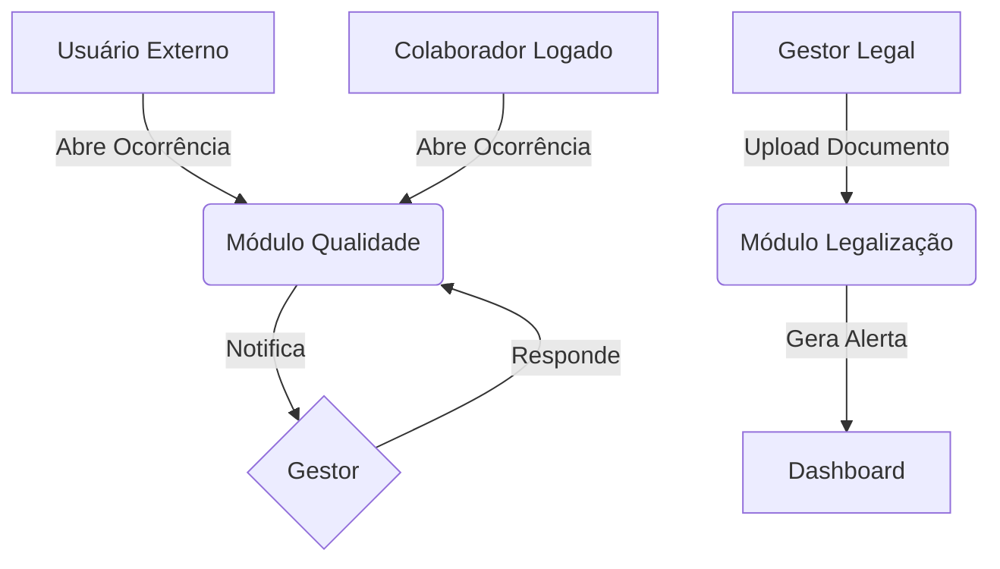

# Manual do Usuário - SQ.CDT_SINAI

Bem-vindo ao Sistema de Qualidade e Legalização (SQ.CDT_SINAI). Este manual guiará você através das principais funcionalidades do sistema.

## 1. Acesso ao Sistema

### Login
Para acessar o sistema, utilize suas credenciais (E-mail e Senha) fornecidas pelo administrador.

1.  Acesse o endereço do sistema.
2.  Digite seu **E-mail** e **Senha**.
3.  Clique em **ACESSAR**.

> **Nota:** Se esqueceu sua senha, entre em contato com o administrador ou utilize a função de recuperação (se habilitada).

### Notificação Anônima (Ocorrência Externa)
Caso você não possua acesso ao sistema ou deseje realizar uma denúncia/sugestão sem se identificar, utilize a opção de **Notificação Anônima** disponível na tela de login.

1.  Na tela de login, localize o cartão amarelo **"Notificação Anônima"**.
2.  Clique sobre ele para abrir o formulário.
3.  Preencha os dados da ocorrência:
    *   **Tipo de Cliente:** Identifique seu perfil (Paciente, Fornecedor, etc.).
    *   **Meio de Contato:** Como você entrou em contato ou quer o retorno .
    *   **Tipo de Ocorrência:** Elogio, Reclamação, etc.
    *   **Para quem:** Área ou profissional alvo.
    *   **Gravidade:** Urgência da resposta.
    *   **Descrição:** Detalhes do ocorrido.
4.  Clique em **Enviar Ocorrência**.

---

## 2. Dashboard (Visão Geral)

Ao entrar, você verá o **Dashboard**, que resume o estado atual da qualidade e legalização.

*   **Alertas de Vencimento:** Cards coloridos no topo mostram documentos vencidos ou a vencer nos próximos dias.
*   **Indicadores:** Total de colaboradores, especializações e ocorrências.
*   **Minhas Ocorrências:** Lista rápida de incidentes atribuídos a você ou abertos por você.
*   **Gráfico:** Distribuição de ocorrências por gravidade.

---

## 3. Módulo de Qualidade (Ocorrências)

Este módulo gerencia incidentes, reclamações e elogios.

### Registrar Ocorrência Interna
Se você é um colaborador logado:
1.  No menu lateral, vá em **Qualidade > Nova Ocorrência** (ou use o botão "Ações Rápidas" no Dashboard).
2.  Preencha o formulário:
    *   **Tipo:** Elogio, Reclamação, etc.
    *   **Gravidade:** Baixa, Média ou Alta (define o prazo de resposta).
    *   **Área/Regional/Marca:** Dados de localização do incidente.
    *   **Alvo:** Quem deve receber/tratar essa ocorrência.
    *   **Descrição:** Detalhes do fato.
3.  Clique em **Registrar**.

### Ocorrências Externas
O público externo pode registrar ocorrências na tela de login (botão "Notificação Anônima"). Essas ocorrências aparecem no menu **Qualidade > Ocorrências Externas** para triagem.

### Responder Ocorrência
1.  Acesse a lista de ocorrências.
2.  Clique em **Responder** na ocorrência desejada.
3.  Descreva a solução ou tratativa e salve.

---

## 4. Módulo de Legalização

Gerencie a documentação regulatória das unidades (Alvarás, Licenças, AVCB).

### Consultar Estabelecimentos
1.  Vá em **Gestão de Legalização > Estabelecimentos**.
2.  Você verá uma lista com uma **Barra de Progresso** colorida indicando o status dos documentos daquela unidade.

### Gerenciar Documentos
1.  Na lista de estabelecimentos, clique no botão azul **Documentos**.
2.  Você verá a lista de documentos obrigatórios.
    *   **Vermelho:** Vencido.
    *   **Verde:** Em dia.
    *   **Amarelo:** Pendente.
3.  Para atualizar um documento (ex: novo Alvará):
    *   Clique em **Atualizar**.
    *   Faça o upload do arquivo PDF/Imagem.
    *   Defina a nova data de validade e status.
    *   **Documentos Digitais (HTML):** Você pode colar o conteúdo de manuais ou bulas diretamente no editor de texto.
        *   **Imagens:** Se copiar de outro site, use o botão "Substituir" nas imagens quebradas para enviar o arquivo do seu computador.
        *   **Tags:** Adicione palavras-chave para facilitar a busca.
    *   **Documento Permanente:** Marque esta opção para documentos que não possuem data de vencimento (ex: Estatutos).
    *   **Renovação Automática:** Se desejar, marque a opção e defina quantos meses o documento deve ser renovado automaticamente ao vencer.
4.  **Relatório:** Clique em "Gerar Relatório" para baixar um PDF com o resumo da situação legal da unidade.
5.  **Leitura:** Para documentos digitais (HTML), clique no botão **Ler**.
    *   Use o botão de **Tela Cheia** no canto superior direito para melhor visualização.
    *   Links internos e "Ir para o topo" funcionam para navegação rápida.

### Tipos de Estabelecimento
Para padronizar a documentação exigida, você pode configurar os tipos de estabelecimento.

1.  Vá em **Gestão de Legalização > Tipos de Estabelecimento**.
2.  Clique em **Novo Tipo** (ou edite um existente).
3.  Preencha o **Nome** e selecione o **Tipo de Local de Atendimento**.
4.  Marque os **Documentos Necessários** para abertura/operação e para encerramento na lista de seleção.
5.  Clique em **Salvar**.

### Histórico de Renovações
O sistema possui um "robô" que verifica diariamente (às 02:00 da manhã) os documentos vencidos configurados para renovação automática.

Para visualizar o que foi feito:
1.  Vá em **Gestão de Legalização > Histórico de Renovações**.
2.  A tabela mostrará a data da execução, qual documento foi renovado e a nova data de validade calculada.

### Reverter Renovação
Caso uma renovação automática tenha ocorrido indevidamente (ex: configurou os meses errados), você pode desfazer a ação:
1.  Acesse o **Histórico de Renovações**.
2.  Localize o registro desejado.
3.  Clique no botão vermelho **Reverter**. O sistema restaurará a data de vencimento anterior e removerá o registro do histórico.

---

## 5. Gestão de Contratos e Aditivos

Além dos documentos legais (Alvarás), o sistema permite gerenciar contratos de prestação de serviços e seus aditivos.

### Acessar Contratos
1.  Vá em **Gestão de Legalização > Estabelecimentos**.
2.  Na lista de unidades, localize a desejada e clique no botão cinza **Contratos** (ícone de aperto de mão).

### Novo Contrato
1.  Na tela de contratos da unidade, clique em **Novo Contrato**.
2.  Preencha os dados principais:
    *   **Dados Básicos:** Número, Tipo (Serviço, Locação, etc.), Fornecedor e Objeto.
    *   **Vigência:** Data de Início e Fim.
    *   **Pagamento:** Selecione a frequência (**Mensal**, **Único** ou **Parcelado**). O sistema ajustará os campos de valor automaticamente.
3.  Anexe o arquivo PDF do contrato original.
4.  Clique em **Salvar**.

### Editar Contrato
Caso precise corrigir informações ou alterar a situação do contrato:
1.  Na lista de contratos, clique no botão amarelo **Editar** (ícone de lápis).
2.  Faça as alterações necessárias nos dados ou valores.
3.  **Status:** Você pode alterar manualmente para **Vigente**, **Rascunho** ou **Cancelado**.
4.  Clique em **Salvar Alterações**.

### Adicionar Termo Aditivo (Emenda)
Quando um contrato sofre alterações (prazo, valor ou escopo), você deve registrar um Aditivo:

1.  Na lista de contratos, clique em **Detalhes** no contrato desejado.
2.  Você verá a linha do tempo do contrato. Clique no botão amarelo **Adicionar Aditivo**.
3.  Preencha os dados do aditivo:
    *   **Número:** Ex: "1º Termo Aditivo".
    *   **Tipo:** Prorrogação, Reajuste, etc.
    *   **Alterações:** Preencha a Nova Data Fim ou Novo Valor apenas se houver mudança. O sistema atualizará o contrato principal automaticamente.
    *   **Arquivo:** Anexe o PDF do aditivo.
4.  Clique em **Salvar Aditivo**. O novo evento aparecerá no topo da linha do tempo.

### Histórico de Renovações Automáticas (Contratos)
Assim como na legalização, o sistema pode renovar contratos automaticamente se configurado.
1.  Vá em **Gestão de Legalização > Hist. Renov. Contratos**.
2.  Utilize os filtros no topo da tela para buscar por **Período** ou por texto (Nome do Estabelecimento, Número do Contrato ou Fornecedor).
3.  A tabela exibirá os detalhes da renovação.
4.  Se necessário, utilize o botão **Reverter** para desfazer uma renovação automática indevida.

### Relatórios de Contratos
O sistema oferece duas formas de visualizar os dados contratuais:
1.  **PDF da Unidade:** Na tela de listagem de contratos de um estabelecimento, clique no botão vermelho **Gerar Relatório** para baixar um arquivo PDF com todos os contratos daquela unidade.
2.  **Dashboard Gerencial:** No menu lateral, vá em **Gestão de Legalização > Relatório Contratos**.
    *   Utilize os filtros para refinar a busca (Regional, Tipo, Status, etc.).
    *   Visualize gráficos de distribuição e valores por regional.
    *   Acompanhe separadamente o **Valor Mensal Recorrente** (custo fixo) e o **Total Pontual/Parcelado** (investimentos).

---

## 6. Módulo de Segurança

(Acesso restrito a Administradores e Gestores)

*   **Colaboradores:** Cadastre novos usuários, defina seus cargos e vincule-os a estabelecimentos específicos.
*   **Perfis de Acesso:** Crie perfis (ex: Auditor, Gerente) e defina permissões.
*   **Matriz de Permissões:** Marque exatamente o que cada perfil pode fazer no sistema.

---

## 7. Relatórios de Ocorrências

O sistema oferece uma ferramenta para análise de dados de qualidade através de gráficos e indicadores.

### Gerar Relatório
1.  No menu lateral, vá em **Qualidade > Relatórios**.
2.  Defina os filtros desejados:
    *   **Período:** Data inicial e final.
    *   **Filtros de Texto:** Regional, Marca, Unidade.
    *   **Filtros de Seleção Múltipla:** Permite selecionar vários itens para **Origem** (Interna/Externa), **Gravidade**, **Status** e **Categorias**.
3.  Clique em **Gerar Relatório**.

### Dashboard de Resultados
Uma nova aba será aberta exibindo:
*   **Totalizador:** Quantidade total de registros encontrados.
*   **Gráficos:** Status, Tipo de Ocorrência, Evolução Mensal, Ocorrências por Área e Tempo Médio de Resolução.
*   **Impressão:** Utilize o botão "Imprimir" no canto superior direito para salvar a visualização em PDF ou imprimir.

### Relatório de Documentos Legais (Dashboard)
Ao gerar o relatório de documentos legais, o sistema utiliza uma lógica inteligente.

> **Nota Importante:** O relatório foi programado para ser "inteligente" e mostrar apenas o que é obrigatório (configurado) para aquele tipo de unidade, para não poluir o gráfico com documentos irrelevantes. Como nada está configurado como obrigatório, o relatório entende que "não há nada a cobrar".
> Certifique-se de que os **Tipos de Estabelecimento** tenham os documentos necessários devidamente vinculados.

---

## 8. Fluxo de Dados (Visão Geral)

Abaixo, um diagrama simplificado de como os dados fluem no sistema:

